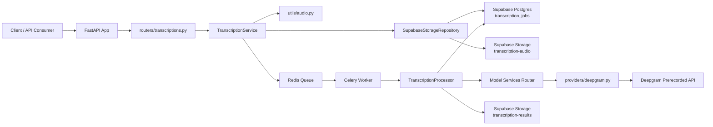
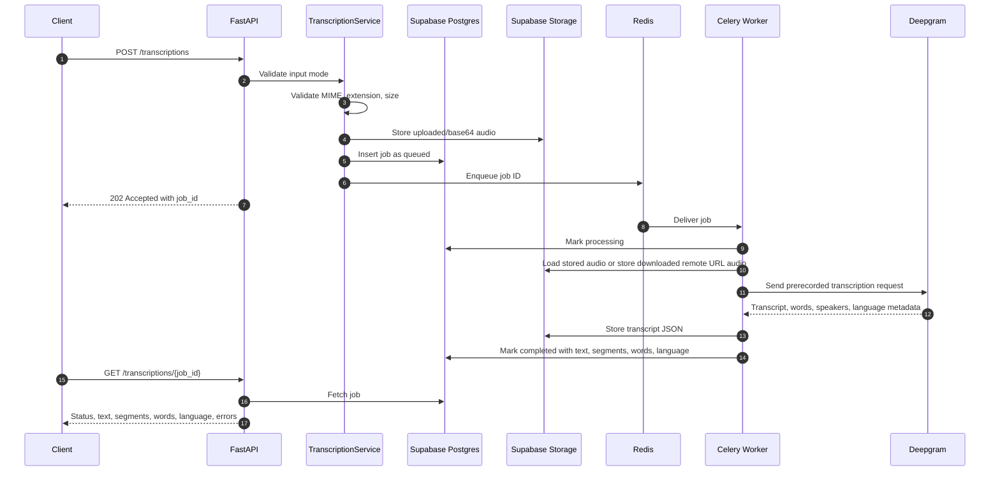
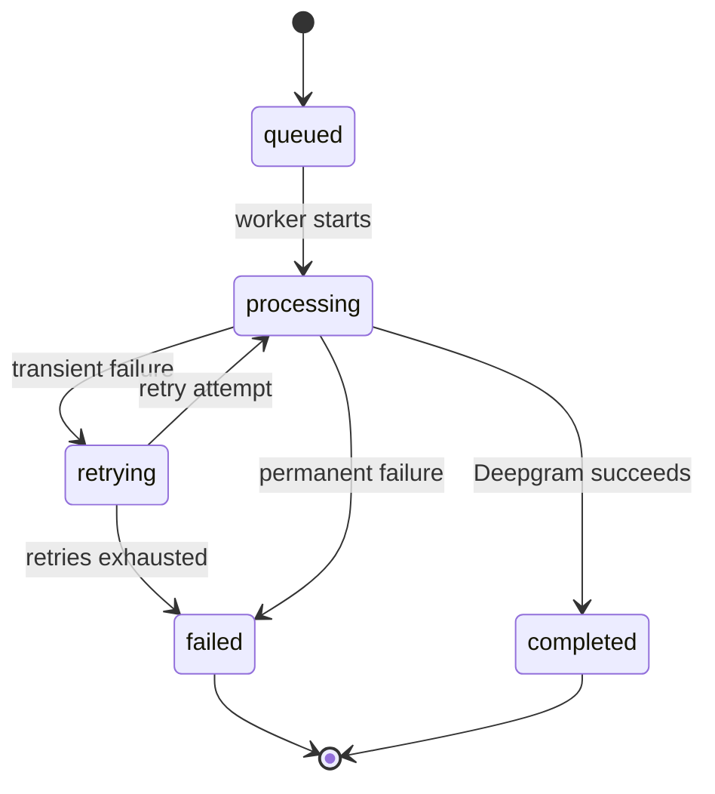
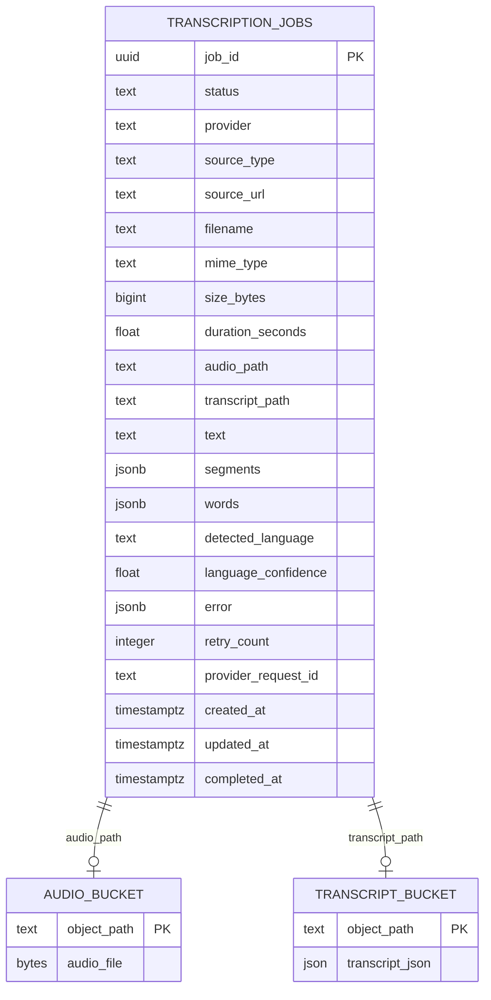

# FastAPI Deepgram Transcription Pipeline

Async transcription API built with Python, FastAPI, Deepgram, Supabase, Celery, and Redis. The service accepts audio as a multipart file, remote URL, or base64 payload, creates a queued job, and returns normalized transcript text with timestamped segments, word-level timestamps, speaker labels, and detected language metadata.

## System Goals

- Accept common audio inputs without authentication.
- Normalize multipart uploads, remote URLs, and base64 payloads into one internal job model.
- Use Deepgram as the only transcription provider.
- Return transcript text with timestamped segments, word-level timestamps, speaker labels, and detected language metadata.
- Persist audio, transcript artifacts, job status, retry count, and provider metadata.
- Process transcription asynchronously so large files do not block API requests.
- Keep the design production-shaped without adding unnecessary provider abstraction or chunking complexity.

## Architecture Overview



The Model Services Router exists as an architectural boundary, but it intentionally routes only to Deepgram. This satisfies the requested architecture while keeping the provider surface honest and simple.

## Request Flow



Remote URL jobs follow the same worker path, except the API stores the URL first and the worker downloads, validates, and stores the audio object before sending it to Deepgram.

## Job State Machine



State meanings:

- `queued`: job metadata is persisted and waiting for a worker.
- `processing`: a worker has claimed the job.
- `retrying`: the last attempt failed with a retryable error.
- `completed`: transcript text, timestamped segments, word timings, speaker labels, and language metadata are persisted.
- `failed`: the job cannot be completed without a new request or manual intervention.

## Storage Model



Supabase Postgres is the system of record for job state. Supabase Storage holds the binary audio and full transcript JSON. The normalized transcript text, segment JSON, word JSON, and language metadata are copied onto the job row so polling does not require an extra Storage read.

## Component Responsibilities

| Component               | Responsibility                                                                                            |
| ----------------------- | --------------------------------------------------------------------------------------------------------- |
| `routers/`              | Defines `/health` and `/transcriptions` HTTP endpoints.                                                   |
| `schemas/`              | Pydantic models for job status, transcript segments, word timings, errors, responses, and domain objects. |
| `services/`             | Normalizes inputs, creates jobs, routes provider calls, and coordinates processing.                       |
| `providers/deepgram.py` | Calls Deepgram prerecorded transcription and normalizes the provider response.                            |
| `storage/`              | Wraps Supabase Postgres and Storage access.                                                               |
| `workers/`              | Runs Celery tasks, retries transient failures, and persists final state.                                  |
| `utils/audio.py`        | Validates format, size, MIME type, base64, URL input, and optional duration.                              |

## Design Decisions

### Input Modes

`POST /transcriptions` accepts exactly one of:

- Multipart file upload
- JSON or form `audio_url`
- JSON or form `audio_base64`

The service rejects requests with zero inputs or multiple inputs. This avoids ambiguous processing and makes job records deterministic.

### Audio Format Handling

Supported formats are MP3, WAV, MP4, M4A, FLAC, Ogg, Opus, and WebM. Validation checks size, extension, declared MIME type, and basic magic bytes where practical. Base64 payloads are decoded before validation. Remote URLs are downloaded by the worker with a streaming size check so a large file cannot be fully loaded before enforcing `MAX_AUDIO_BYTES`.

### Long Audio Handling

All transcription work is async. The API returns a job ID immediately and Celery performs the Deepgram call in the background. The default limits are `25MB` and `30 minutes`. Files above those limits are rejected rather than chunked. That keeps v1 reliable and easy to reason about because chunking requires offset reconciliation, transcript stitching, partial retry behavior, and more complex result ordering.

### Retry And Recovery

Transient Deepgram, network, rate-limit, and storage errors move the job to `retrying` and are retried with exponential backoff capped at 300 seconds. Permanent validation failures move directly to `failed`. Retry counts and errors are stored in Postgres. Processing is idempotent at the job level: completed jobs are skipped, and Storage object paths are deterministic by job ID.

### Concurrency

FastAPI handles concurrent uploads while Celery handles concurrent transcription processing. Redis decouples API traffic from worker capacity. API instances and worker instances can scale independently. Celery prefetch is set to 1 to reduce head-of-line blocking when large jobs are mixed with small jobs.

### API Surface

The API is intentionally small:

- `POST /transcriptions`: create an async transcription job.
- `GET /transcriptions/{job_id}`: poll status and retrieve results.
- `GET /health`: check basic service configuration.

There is no authentication because the assignment explicitly says authentication is not required.

## How To Run Locally

1. Create and activate a Python 3.11 environment.
2. Install dependencies:

```bash
pip install -r requirements.txt
```

3. Copy `.env.example` to `.env` and fill in Deepgram, Supabase, and Redis settings.
4. Run `supabase/schema.sql` in the Supabase SQL editor.
5. Start Redis, the API, and the worker:

```bash
uvicorn app.main:app --reload
celery -A app.workers.celery_app.celery_app worker -Q transcriptions --loglevel=INFO
```

With Docker:

```bash
docker compose up --build
```

## Environment Variables

Required:

- `DEEPGRAM_API_KEY`
- `SUPABASE_URL`
- `SUPABASE_SERVICE_ROLE_KEY`
- `REDIS_URL` or both `CELERY_BROKER_URL` and `CELERY_RESULT_BACKEND`

Optional:

- `SUPABASE_AUDIO_BUCKET`, default `transcription-audio`
- `SUPABASE_TRANSCRIPT_BUCKET`, default `transcription-results`
- `SUPABASE_JOBS_TABLE`, default `transcription_jobs`
- `MAX_AUDIO_BYTES`, default `26214400`
- `MAX_AUDIO_SECONDS`, default `1800`
- `WORKER_MAX_RETRIES`, default `3`
- `WORKER_RETRY_BACKOFF_SECONDS`, default `15`

## Deepgram Setup

Create a Deepgram API key and set `DEEPGRAM_API_KEY`. The worker calls Deepgram's prerecorded transcription endpoint with:

- `model=nova-3`
- `smart_format=true`
- `utterances=true`
- `diarize=true`
- `detect_language=true`

Word-level timing data is parsed from Deepgram's `words` array. Segment-level speaker labels are copied from Deepgram utterances when available, with a fallback to the word speaker when a word-derived segment has one consistent speaker.

Only Deepgram is implemented. The Model Services Router exists to keep the provider boundary explicit, but it rejects every provider except Deepgram.

## Supabase Setup

Run `supabase/schema.sql` to create:

- `public.transcription_jobs`
- `transcription-audio` private Storage bucket
- `transcription-results` private Storage bucket

Use a server-side service role key because the API has no user authentication and must write both Postgres metadata and private Storage objects.

## API Examples

Create a job from a file:

```bash
curl -X POST http://localhost:8000/transcriptions \
  -F "file=@sample.mp3"
```

Create a job from a remote URL:

```bash
curl -X POST http://localhost:8000/transcriptions \
  -H "Content-Type: application/json" \
  -d '{"audio_url":"https://example.com/audio.mp3"}'
```

Create a job from base64:

```bash
curl -X POST http://localhost:8000/transcriptions \
  -H "Content-Type: application/json" \
  -d '{"audio_base64":"data:audio/mpeg;base64,SUQzYXVkaW8="}'
```

Poll a job:

```bash
curl http://localhost:8000/transcriptions/<job_id>
```

Successful response shape:

```json
{
  "job_id": "4f58937d-a425-44b2-91f1-e849fcaa2a3d",
  "status": "completed",
  "provider": "deepgram",
  "text": "Hello world.",
  "segments": [
    {
      "start": 0.0,
      "end": 1.2,
      "text": "Hello world.",
      "speaker": 0
    }
  ],
  "words": [
    {
      "word": "hello",
      "punctuated_word": "Hello",
      "start": 0.0,
      "end": 0.5,
      "confidence": 0.99,
      "speaker": 0,
      "speaker_confidence": 0.95
    }
  ],
  "detected_language": "en",
  "language_confidence": 0.98,
  "error": null,
  "retry_count": 0
}
```

## Known Limitations

- Supabase is required for runtime processing; there is no SQLite fallback in this implementation.
- Duration validation depends on `ffprobe`; if it is unavailable or cannot parse the file, the service still validates size and format.
- Word-level output can be large for long files because every recognized word is persisted in Postgres and transcript JSON.
- Remote URL duration is only known after the worker downloads the file.
- The API does not currently expose cancellation or job deletion.

## Future Improvements

- Deepgram callback/webhook flow for provider-side async completion.
- Optional chunking for very large files with segment offset reconciliation.
- Separate worker queues by file size or priority.
- Signed upload URLs for direct-to-storage client uploads.
- Job cancellation and retention cleanup.
- Per-request Deepgram option overrides for teams that want to disable speaker, word, or language metadata on selected jobs.
